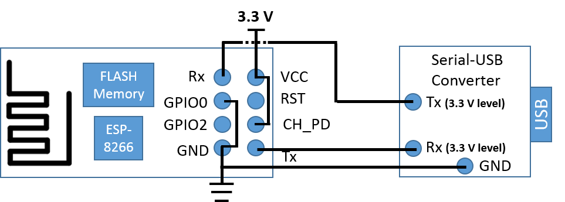

# Introduction 
Thi repo is intended to use the ESP-8266 board to get TEMP and HUM data from SHT21 sensor.

# Description 

Given to the capabilities of the ESP8266-01 board (size, wifi, etc), we can use to communitate through I2C protocol, to other devices.
In this case we will use a SHT21 sensor board. It is a easy sensor to work with and uses I2C protocol.

# Requirements

* Arduino 1.8
* USB - Serial Adapter
* ESP 8266-01
* SHT21 sensor
* SHT21 libreary (see dependencies)
* board should be added "http://arduino.esp8266.com/stable/package_esp8266com_index.json."

# Wire config to upload programm

In order to upload new programms to the ESP8266-01, we need to do the following wiring.

